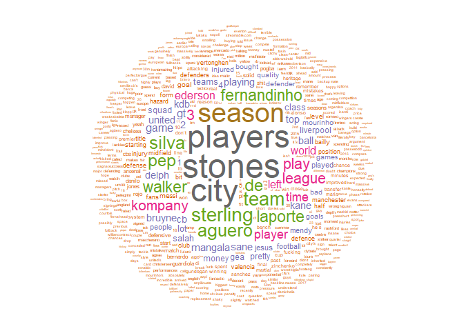
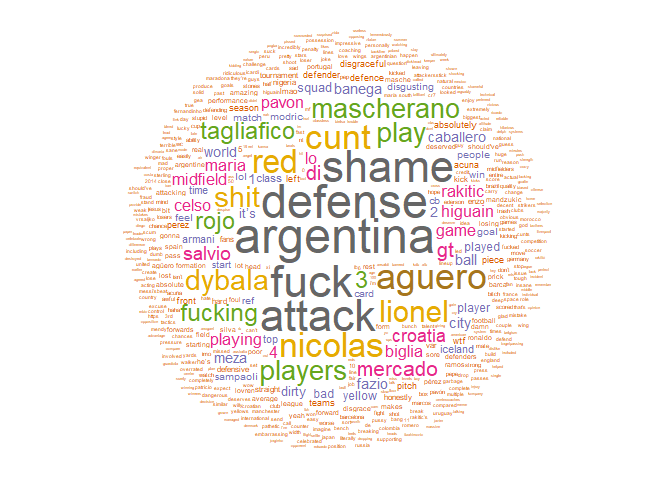

Word clouds associated with Otamendi before and during the 2018 World Cup
================

Packages needed
---------------

``` r
library(tidyverse)
library(tidytext)
library(wordcloud)
library(RColorBrewer)
```

Extracting the data using Pushshift API
---------------------------------------

Parameters for searching:

-   API endpoint: api.pushshift.io/reddit/comment/search
-   Subreddit: soccer
-   Search term: Otamendi
-   Fields to extract: body, subreddit, and created\_utc (date)
-   Number of comments to download: 1,000
-   Date boundaries:
    -   Before World Cup: 2017-12-31 to 2018-06-13
    -   During World Cup: after 2018-06-13

``` r
# Getting 1,000 comments that mentioned Otamendi about 6 months before the World Cup

link <- "https://api.pushshift.io/reddit/comment/search?subreddit=soccer&q=Otamendi&fields=body,subreddit,created_utc&before=1528934399&after=1514764800&size=1000"

before <- jsonlite::fromJSON(url(link))

before2 <- before$data

# Getting 1,000 comments that mentioned Otamendi during the World Cup

link2 <- "https://api.pushshift.io/reddit/comment/search?subreddit=soccer&q=Otamendi&fields=body,subreddit,created_utc&after=1528934399&size=1000"

after <- jsonlite::fromJSON(url(link2))

after2 <- after$data
```

Processing and visualization for data before the World Cup
==========================================================

``` r
# Subsetting
words_before <- before2 %>%
  select(body) 

# Unnesting comments into single words
words2_before <- words_before %>%
  unnest_tokens(word, body)

# Removing common words
words3_before <- words2_before %>%
  anti_join(stop_words, by = "word") 

# Preparing dataframe for plotting
# Also removing unwanted words
for_word_cloud_before <- words3_before %>%
  ungroup() %>% 
  select(word) %>% 
  count(word) %>%
  arrange(desc(n)) %>%
  filter(!word %in% c("otamendi"), n > 1) 

# Choosing color palette
pal <- brewer.pal(8, "Dark2")
pal <- pal[-(1)]

# Word cloud
for_word_cloud_before %>%
  with(wordcloud(word, n, random.order = F, use.r.layout = F, 
                 min.freq = 8, rot.per = 0, random.color = F, 
                 colors = pal, scale = c(3,0.2)))
```



Processing and visualization for data during the World Cup
==========================================================

``` r
# Subsetting
words <- after2 %>%
  select(body) 

# Unnesting comments into single words
words2 <- words %>%
  #group_by(id, author, author_flair_text, created_utc) %>%
  unnest_tokens(word, body)

# Removing common words
words3 <- words2 %>%
  anti_join(stop_words, by = "word") 

# Preparing dataframe for plotting
# Also remvving unwanted words
for_word_cloud <- words3 %>%
  ungroup() %>% 
  select(word) %>% 
  count(word) %>%
  arrange(desc(n)) %>%
  filter(!word %in% c("otamendi", "Messi", "messi", "team", "built"))

# Choosing color palette
pal <- brewer.pal(8, "Dark2")
pal <- pal[-(1)]

# Word cloud
for_word_cloud %>%
  with(wordcloud(word, n, random.order = F, use.r.layout = F, 
                 min.freq = 3, rot.per = 0, random.color = F, 
                 colors = pal, scale = c(3,0.2)))
```


